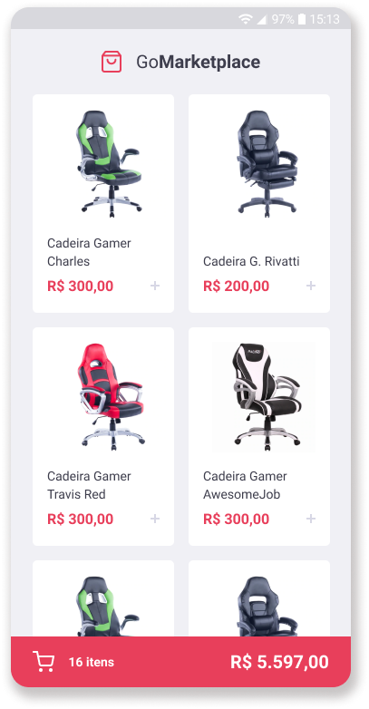
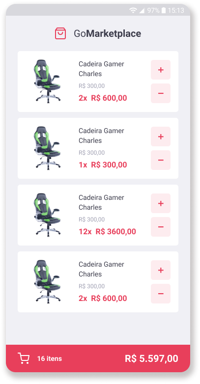

  <p align="center">
    
    </br>
    
    
  </p>

<h3 align="center">
  Foi desenvolvida uma nova aplicação, a GoMarketplace, que é composta por uma tela inicial, em que há a lsitagem dos produtos disponíveis para compra, e uma tela para o carrinho, onde é possível visualizar os produtos que foram adicionados na primeira tela, bem como incluir ou remover mais quantidade e nas duas rotas é possível acompanhar a quantidade e valor total da compra em andamento. O objetivo foi a prática do que foi aprendido em relação ao React Native junto com o TypeScript, utilizando rotas, Async Storage e a Context API.

</h3>

<p align="center">
  

  

  
</p>

<p align="center">
  <a href="#funcionalidades">Funcionalidades</a>&nbsp;&nbsp;&nbsp;|&nbsp;&nbsp;&nbsp;
  <a href="#heavy_check_mark-configurações-necessárias">Configurações necessárias</a>&nbsp;&nbsp;&nbsp;|&nbsp;&nbsp;&nbsp;
  <a href="#arrow_down_small-clonando-o-repositório">Clonando o repositório</a>&nbsp;&nbsp;&nbsp;|&nbsp;&nbsp;&nbsp;
  <a href="#beginner-iniciando-a-aplicação">Iniciando a aplicação</a>&nbsp;&nbsp;&nbsp;|&nbsp;&nbsp;&nbsp;
  <a href="#wrench-tecnologias--ferramentas--recursos">Tecnologias | Ferramentas | Recursos</a>&nbsp;&nbsp;&nbsp;|&nbsp;&nbsp;&nbsp;
  <a href="#memo-license">Licença</a>
</p>

Durante as aulas do [RocketSeat GoStack Bootcamp](https://rocketseat.com.br/bootcamp) foram aprendidos conteúdos relacionados a React Native junto com TypeScript, , utilizando rotas, Async Storage e a Context API. Para treinar o que foi aprendido até o momento foi desenvolvida uma aplicação que utiliza uma API fictícia e nos permite praticar o que vem sendo ensinado.

### Funcionalidades

- Listagem dos produtos da API fictícia;
- Adição de itens da tela inicial no carrinho;
- Exibição dos itens que já foram adicionados ao carrinho;
- Aumento da quantidade de itens no carrinho;
- Redução da quantidade de itens no carrinho;
- Exibição do valor e quantidade total da compra até o momento nas duas telas.

### :heavy_check_mark: Configurações necessárias

Seguem as configurações neessárias para visualizar a aplicação em sua máquina.

-  [Git](https://git-scm.com);
-  [Node](https://nodejs.org/);
-  [Yarn](https://yarnpkg.com/);
-  Ambiente para desenvolvimento mobile configurado conforme sistema operacional utilizado.

### :arrow_down_small: Clonando o repositório
1. Pelo terminal, acesse o diretório em que deseja ter o repositório clonado e execute o comando a seguir.
```bash
# clonando o repositório
git clone https://github.com/belapferreira/fundamentos-react-native
```

### :beginner: Iniciando a aplicação
1. Inicialize o emulador ou conecte o dispositivo físico e verifique a disponibilidade em uma janela do terminal.
```bash
# verificando dispositivos disponíveis
adb devices
```
2. Pelo terminal, acesse o diretório clonado e execute os comandos abaixo.
```bash
# instalando as dependências
yarn install

# iniciando a API fictícia
yarn json-server server.json -p 3333

# instalando a aplicação no dispositivo
react-native run-android

# iniciando a aplicação
react-native start

# carregando a aplicação
digite r no terminal || cmd + r e reload || ctrl + m e reload
```
### :mag: Realizando os testes
1. Foi usado um template que contém testes para orientar o que esperava-se dos blocos de códigos a serem programados. Para verificar se qualquer alteração realizada atende aos requisitos solicitados, acesse o terminal e execute o seguinte comando:
```bash
# testando atendimento aos requisitos
yarn test
```

### :wrench: Tecnologias | Ferramentas | Recursos

Esse projeto foi desenvolvido utilizando os seguintes recursos:

-  [Axios](https://github.com/axios/axios);
-  [Eslint](https://eslint.org/);
-  [Intl](https://github.com/andyearnshaw/Intl.js/);
-  [Jest](https://jestjs.io/);
-  [Json Server](https://github.com/typicode/json-server);
-  [Prettier](https://prettier.io/);
-  [React](https://pt-br.reactjs.org/);
-  [React Native](https://reactnative.dev/);
-  [React Native Async Storage](https://github.com/react-native-community/async-storage);
-  [React Native Gesture Handler](https://github.com/software-mansion/react-native-gesture-handler);
-  [React Native iPhone X Helper](https://github.com/ptelad/react-native-iphone-x-helper);
-  [React Native Masked View](https://github.com/react-native-community/react-native-masked-view);
-  [React Native Reanimated](https://github.com/software-mansion/react-native-reanimated);
-  [React Native Safe Area Context](https://github.com/th3rdwave/react-native-safe-area-context);
-  [React Native Screens](https://github.com/software-mansion/react-native-screens);
-  [React Native Vector Icons](https://github.com/oblador/react-native-vector-icons);
-  [React Navigation 5.0](https://reactnavigation.org/blog/2020/02/06/react-navigation-5.0/);
-  [Styled Components](https://styled-components.com/);
-  [TypeScript](https://www.typescriptlang.org/).

### :memo: License
Esse projeto está sob MIT license. Veja [LICENSE](https://github.com/belapferreira/fundamentos-reactjs/blob/master/LICENSE) para mais informações.

---

Feito por Bela Ferreira :blue_heart: Contato: https://www.linkedin.com/in/belapferreira :blush:
